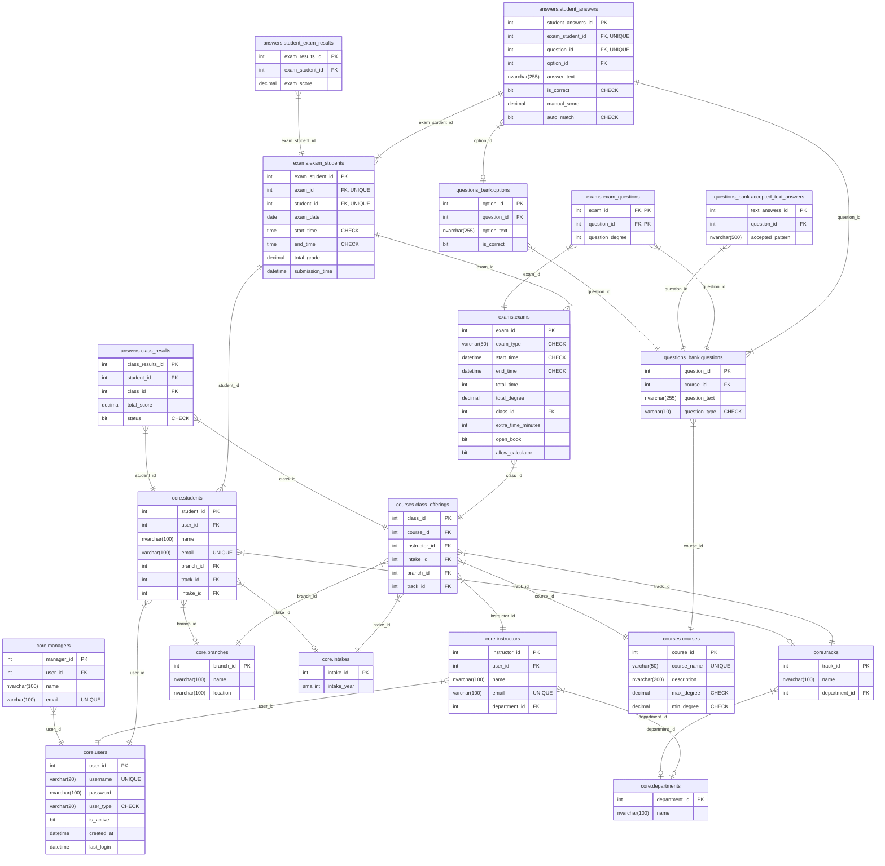

<h1 align="center">📝 ITI Examination System</h1>

  

  A database project designed to manage students, exams, questions, and grades efficiently.

---
## ERD

---
## Team Members
- [AbdAelrahman Mostafa Mohamed](https://github.com/Abdo71d)
- [Nora Magdy Mohamed](https://github.com/noramagdy)
- [Hussein Mohamed Suleiman](https://github.com/husseinmohamed7)
- [Mina Essam Azmy](https://github.com/minaessam95)
- [Maher Mahmoud Elmoghazi](https://github.com/maher-dataconsult)

## Tech Stack
- SQL Server
- GitHub
- Trello
- Mermaid
- VScode
